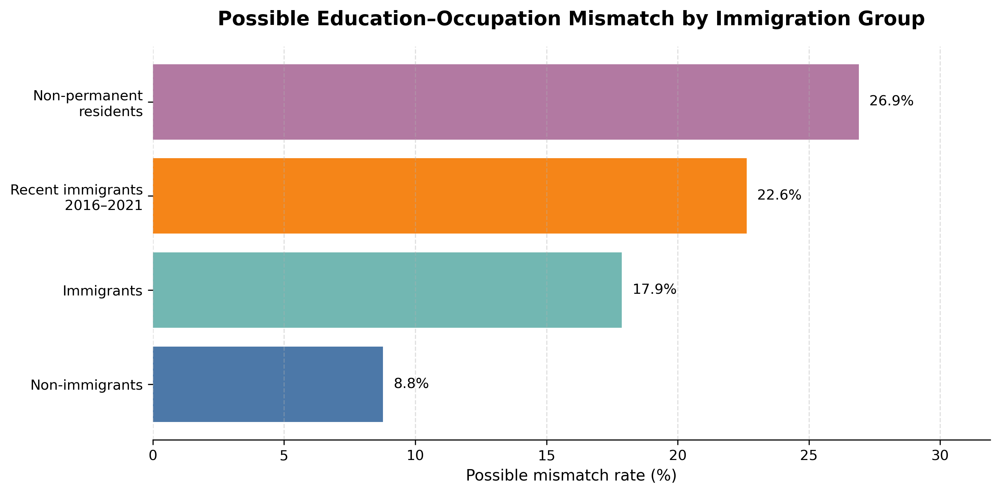

# Education–Occupation Mismatch Among Immigrants in Canada

## Project Overview

This project analyzes possible education–occupation mismatch among immigrants in Canada with a bachelor's degree or higher.

The main goal is to compare whether highly educated immigrants are more likely than non-immigrants to work in occupations that may be below their education level. The analysis uses TEER occupation categories from Statistics Canada as a proxy to identify possible mismatch.

## Research Question

Are immigrants in Canada with a bachelor's degree or higher more likely than non-immigrants to work in occupations below their education level?

## Dataset

The dataset was created from Statistics Canada Table 98-10-0443-01.

The analysis focuses on:

* Geography: Canada and Ontario
* Education level: Bachelor's degree or higher
* Age group: 25 to 64 years
* Gender: Total - Gender
* Statistic: Count
* Immigration status: Non-immigrants, immigrants, recent immigrants, and non-permanent residents
* Occupation classification: TEER categories

## Tools Used

* Python
* Pandas
* Matplotlib
* SciPy
* Jupyter Notebook

## Methodology

The analysis grouped TEER occupation categories into three broader groups:

* TEER 0–1: More aligned occupations
* TEER 2–3: Intermediate occupations
* TEER 4–5: Possible education–occupation mismatch

TEER 4 and TEER 5 were used as a proxy for possible mismatch because these occupations usually require lower levels of formal education or training compared with occupations in TEER 0 and TEER 1.

The project includes:

* Data cleaning and preparation
* Pivot tables by immigration group and TEER category
* Descriptive analysis of possible mismatch rates
* Two-proportion z-test
* Confidence intervals
* Chi-square test of independence
* Cramér’s V effect size
* Canada vs Ontario comparison

## Key Findings

At the national level, immigrants with a bachelor's degree or higher had a possible mismatch rate of approximately 17.9%, compared with 8.8% for non-immigrants.

The difference was about 9.1 percentage points. The relative risk was approximately 2.04, meaning that highly educated immigrants were about twice as likely as non-immigrants to be working in TEER 4 or TEER 5 occupations.

The two-proportion z-test showed that this difference was statistically significant, with a p-value below 0.001.

The confidence interval also supported the result because the interval for the difference did not include 0.

The chi-square test showed that TEER group distribution is associated with immigration status. However, Cramér’s V suggested that the strength of the association was relatively weak, meaning that immigration status is related to occupation level but does not explain the full pattern by itself.

The Ontario analysis showed a similar pattern. In Ontario, immigrants had a possible mismatch rate of about 16.6%, compared with 9.6% for non-immigrants. The difference was about 7.0 percentage points, and the relative risk was approximately 1.73.

## Main Chart

The chart below shows the possible mismatch rate by immigration group in Canada.

## Limitations

This analysis uses TEER 4 and TEER 5 as a proxy for possible education–occupation mismatch. This is useful for identifying a general pattern, but it does not measure each person's exact field of study, work experience, language level, credential recognition status, or individual job requirements.

The data is also aggregated, which means the results show group-level patterns but do not explain the personal reasons behind those patterns.

Other factors such as Canadian work experience, language ability, age, gender, province, field of study, and professional networks may also influence education–occupation mismatch.

## Conclusion

The results suggest that highly educated immigrants in Canada are more likely than non-immigrants to work in occupations that may be below their education level.

The statistical tests support the conclusion that the difference between immigrants and non-immigrants is statistically significant. However, the results should be interpreted carefully because the analysis shows association, not causation.

Overall, this project highlights a meaningful labour market pattern and shows how public data can be used to explore education, immigration, and employment outcomes in Canada.
